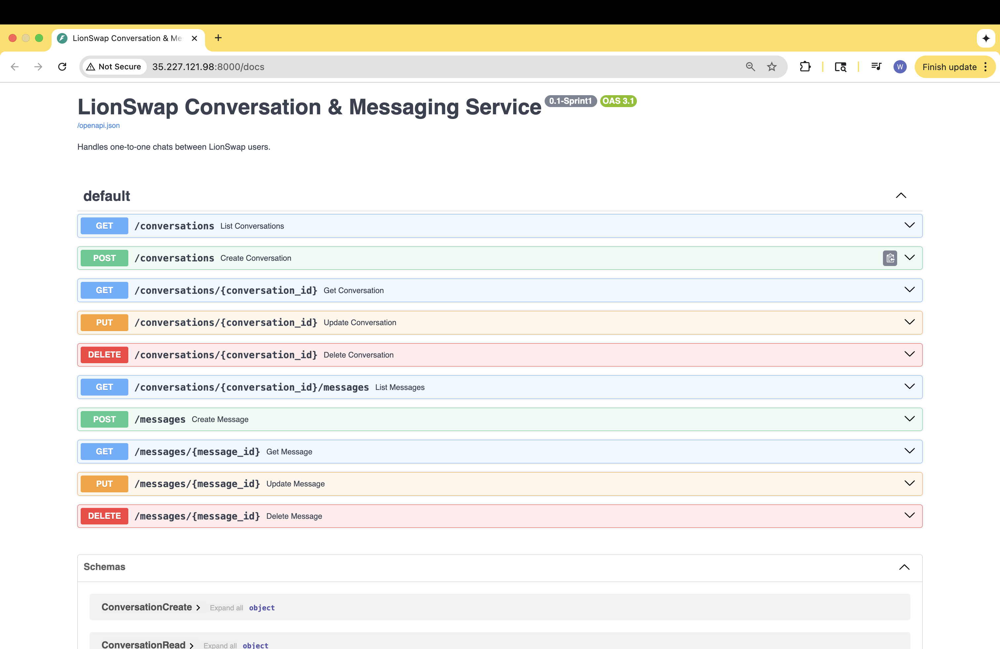

# LionSwap Conversation & Messaging Service

**Author:** Wenhe(Kendall) Ma (wm2544@columbia.edu)

---

## Overview

This microservice is responsible for **one-to-one chat and messaging** between Columbia students on the LionSwap platform.  
It enables buyers and sellers to start conversations, send messages, and retrieve chat histories. This microservice is successfully deployed on a vm on google cloud.


---

## Responsibilities

| Functionality     | Description                                              |
| ----------------- | -------------------------------------------------------- |
| **Conversations** | Create and manage chat sessions between two users.       |
| **Messages**      | Send, retrieve, and list messages within a conversation. |

---

## Entities & Data Models

| Entity           | Description                                    | Key Fields                                                                     |
| ---------------- | ---------------------------------------------- | ------------------------------------------------------------------------------ |
| **Conversation** | Represents a chat between two users.           | `conversation_id`, `user1_id`, `user2_id`, `created_at`, `last_message_at`     |
| **Message**      | Individual chat message within a conversation. | `message_id`, `conversation_id`, `sender_id`, `content`, `timestamp`, `status` |

---

## API Design

| Method | Endpoint                           | Description                                         |
| ------ | ---------------------------------- | --------------------------------------------------- |
| `GET`  | `/conversations`                   | List all conversations (returns mock data)          |
| `POST` | `/conversations`                   | Create a new conversation (returns NOT IMPLEMENTED) |
| `GET`  | `/conversations/{conversation_id}` | Get details of a specific conversation              |
| `GET`  | `/messages`                        | List all messages (mock data)                       |
| `POST` | `/messages`                        | Send a new message (returns NOT IMPLEMENTED)        |
| `GET`  | `/messages/{message_id}`           | Retrieve message details                            |

---

## Deployment Details

**Deployed on:** Google Cloud  
**VM Name:** lionswap-conversation-vm  
**Region:** us-central1-c  
**Instance Type:** e2-micro (Ubuntu 22.04 LTS)  
**Firewall Port:** TCP 8000

**Public URL:**  
 [http://external ip address:8000/docs](http://external ip address:8000/docs)

### Commands Used

```bash
sudo apt update -y
sudo apt install python3-venv git -y
git clone https://github.com/wenhema/lionswap-conversation-service.git
cd lionswap-conversation-service
python3 -m venv .venv
source .venv/bin/activate
pip install -r requirements.txt
python -m uvicorn main:app --host 0.0.0.0 --port 8000
```
